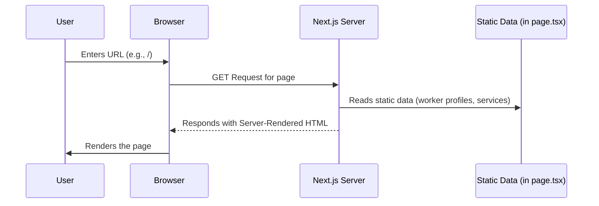
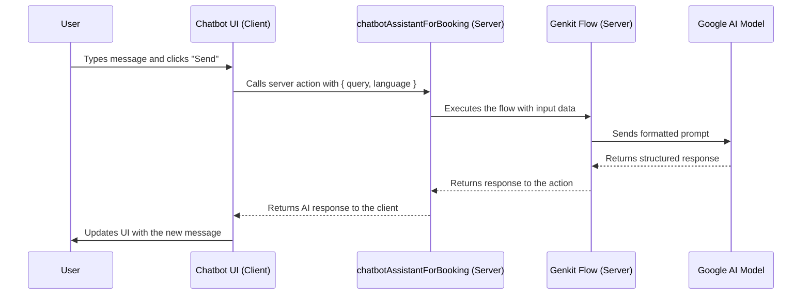

# Project Report: LocSetu Connect

**Version:** 1.0.0

## 1. Project Overview

LocSetu Connect is a modern web application built with Next.js, designed to serve as a platform connecting users with local service professionals like plumbers, electricians, and tailors. The application prioritizes user experience with a clean, responsive interface, multi-language support (English, Hindi, Marathi), and modern features like a light/dark theme toggle.

A key feature is the integration of an AI-powered chatbot using Google's Genkit and Gemini model. This assistant helps users navigate the services and make bookings in their preferred language, making the platform more accessible and user-friendly.

---

## 2. Tech Stack

The project leverages a modern, robust tech stack chosen for performance, developer experience, and scalability.

-   **Framework**: **Next.js 15** (using the App Router). Chosen for its server-side rendering (SSR), static site generation (SSG), file-based routing, and performance optimizations.
-   **UI Library**: **React 18**. The industry standard for building interactive user interfaces with a component-based architecture.
-   **Language**: **TypeScript**. For static typing, which improves code quality, readability, and reduces runtime errors.
-   **Styling**: **Tailwind CSS**. A utility-first CSS framework for rapid UI development and consistent design.
-   **Component Library**: **ShadCN UI**. A collection of beautifully designed, reusable, and accessible components built on top of Radix UI and Tailwind CSS.
-   **AI Integration**: **Genkit**. An open-source framework from Google for building production-ready AI-powered features. It's used to define and manage the AI flow that communicates with the language model.
-   **AI Model**: **Google Gemini**. The underlying large language model (LLM) that powers the chatbot's intelligence.
-   **Icons**: **Lucide React**. A comprehensive and consistent set of open-source icons.
-   **Theming**: **next-themes**. A library to manage light/dark mode theming in Next.js applications.

---

## 3. File Structure and Breakdown

The project follows a standard Next.js App Router structure.

```
.
├── src/
│   ├── ai/
│   │   ├── flows/
│   │   │   └── chatbot-assistant.ts  # Genkit flow for the AI chatbot
│   │   ├── dev.ts                    # Genkit development server entrypoint
│   │   └── genkit.ts                 # Genkit AI plugin configuration
│   │
│   ├── app/
│   │   ├── globals.css               # Global styles and Tailwind CSS layers
│   │   ├── layout.tsx                # Root layout for the entire app (English)
│   │   ├── page.tsx                  # Homepage content (English)
│   │   ├── hi/                       # Route group for Hindi language
│   │   │   ├── layout.tsx
│   │   │   └── page.tsx
│   │   └── mr/                       # Route group for Marathi language
│   │       ├── layout.tsx
│   │       └── page.tsx
│   │
│   ├── components/
│   │   ├── ui/                       # Auto-generated ShadCN UI components
│   │   ├── chatbot.tsx               # The AI chatbot interface
│   │   ├── footer.tsx                # Site-wide footer
│   │   ├── header.tsx                # Site-wide header with navigation
│   │   ├── service-category-card.tsx # Card for displaying service types
│   │   ├── theme-provider.tsx        # Wrapper for next-themes
│   │   ├── theme-toggle.tsx          # Light/dark mode switch component
│   │   └── worker-profile-card.tsx   # Card for displaying worker profiles
│   │
│   ├── hooks/
│   │   ├── use-mobile.tsx            # Custom hook to detect mobile devices
│   │   └── use-toast.ts              # Custom hook for showing toast notifications
│   │
│   └── lib/
│       ├── types.ts                  # TypeScript type definitions
│       └── utils.ts                  # Utility functions (e.g., `cn` for classnames)
│
├── public/                         # Static assets (images, fonts, etc.)
├── tailwind.config.ts              # Tailwind CSS configuration
├── next.config.ts                  # Next.js configuration
├── package.json                    # Project dependencies and scripts
└── README.md                       # Project README
```

### Key File Explanations:

-   **`src/ai/flows/chatbot-assistant.ts`**: This is a server-side file that defines the AI logic. It uses Genkit to create a "flow" that takes a user's query and language, constructs a prompt for the Gemini model, and returns the model's response.
-   **`src/app/layout.tsx`**: The root layout. It defines the `<html>` and `<body>` tags and wraps all pages. It's where global providers like `ThemeProvider` are initialized.
-   **`src/app/page.tsx`**: The entry point for the homepage (`/`). It contains the main content, including the hero section, service categories, and featured workers.
-   **`src/app/(hi|mr)/page.tsx`**: These are the translated versions of the homepage, with all text content in Hindi and Marathi, respectively.
-   **`src/components/chatbot.tsx`**: A client-side component that manages the chat UI state (messages, input). It communicates with the Genkit flow on the server by calling a Next.js Server Action (`chatbotAssistantForBooking`).
-   **`src/components/header.tsx`**: Contains the site logo, navigation links, and the theme and language toggles.
-   **`tailwind.config.ts` & `src/app/globals.css`**: These files define the design system. `globals.css` contains the HSL color variables for light and dark modes, which are used by Tailwind and ShadCN components.

---

## 4. Data Flow Diagram (DFD)

This section describes the key data flows in the application.

### 4.1. User Page Load

A standard server-side rendering flow where Next.js builds the page on the server and sends complete HTML to the client.



### 4.2. AI Chatbot Interaction

This is a client-server flow that leverages Next.js Server Actions to securely call server-side AI logic from the client.



---

## 5. How to Run the Project

1.  **Install Dependencies**:
    ```bash
    npm install
    ```
2.  **Run the Development Server**:
    ```bash
    npm run dev
    ```
3.  **Access the Application**:
    Open [http://localhost:9002](http://localhost:9002) in your web browser.

This will start the Next.js development server with Turbopack for fast refresh and performance.
